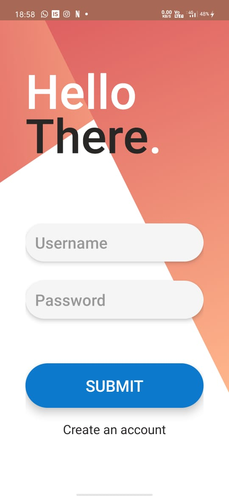

# LoginPage
Customized button and textviews with proper resource files

# Screenshot of page

Used
->Linear layout
->EditText for username and passwords
->button
->backgroung of text field and button is cutomized with gradient colour
->for better practice use resources like strings,drawable and colors, dont hardcode.

Resources to learn 
- [Android Documentation](https://developer.android.com/guide)
- [EditText](https://developer.android.com/reference/android/widget/EditText)
- [Buttons](https://developer.android.com/reference/android/widget/EditText)
- [Resources](https://developer.android.com/guide/topics/resources/available-resources)

